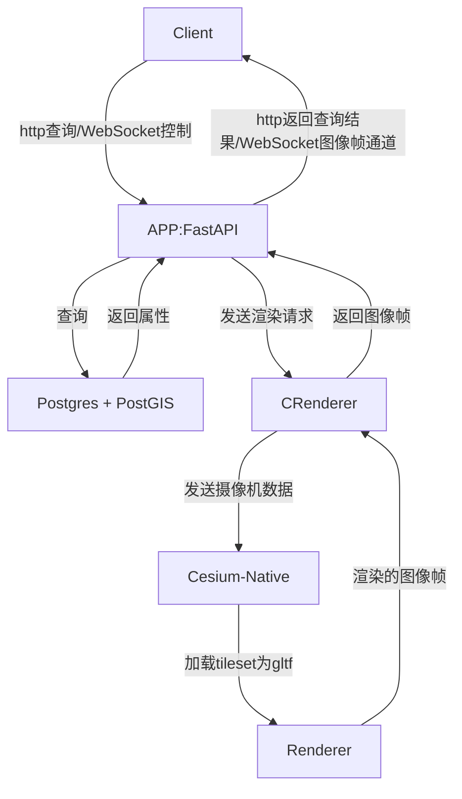

# 系统架构

DreamCatcher服务端采用模块化设计，由多个相互协作的组件构成。本文档描述系统的整体架构和各组件之间的关系。

## 整体架构

DreamCatcher系统由以下主要组件构成：

1. **DreamCatcher-Client**: 前端应用，提供用户界面
2. **DreamCatcher-Server-Headless**: 后端服务，处理业务逻辑和数据存储
   - **app**: FastAPI应用，提供HTTP和WebSocket接口
   - **db**: PostgreSQL数据库，存储计划和用户数据
   - **CRenderer**: 渲染服务，基于Cesium-Native和自定义Vulkan渲染器

系统架构图如下：



## 组件详解

### APP (FastAPI)

后端应用服务，基于FastAPI框架开发，提供以下功能：

- HTTP REST API：处理拍摄计划的CRUD操作
- WebSocket接口：与渲染器通信，推送渲染结果到前端
- 数据校验：使用Pydantic模型进行数据校验

目录结构：

```
app/
├─ main.py              # 入口：挂路由 & 启动事件
├─ api/                 # 路由层
│  ├─ plans.py          # /plans* HTTP CRUD
│  └─ media_ws.py       # /ws/render/{plan_id} WebSocket
├─ services/            # 业务逻辑
│  ├─ plan_service.py   # 调 DB + 校验
│  └─ media_service.py  # 调 MediaGateway
├─ core/                # 共用工具
│  ├─ config.py         # 读取 .env（DB_URL、GATEWAY_ADDR 等）
│  └─ media_interface.py# 抽象 + StubGateway
├─ schemas/             # Pydantic 数据模型
│  └─ plan.py
├─ models.py            # SQLAlchemy ORM模型
└─ db.py                # 数据库配置
```

### DB (PostgreSQL)

数据库服务，使用PostgreSQL存储拍摄计划数据：

- 表设计：使用SQLAlchemy ORM定义数据模型
- 数据存储：存储计划、用户和其他相关数据
- 空间数据：支持地理空间数据查询（使用PostGIS）

### CRenderer

渲染服务，负责根据拍摄计划渲染场景：

- 基于Cesium-Native：加载3D地形和建筑数据
- 自定义渲染器：使用Vulkan进行高性能渲染
- WebSocket接口：接收渲染请求，推送渲染帧

## 通信流程

1. **计划管理流程**：
   - 客户端通过HTTP API创建/更新拍摄计划
   - 服务端验证数据并存储到数据库
   - 客户端可以查询和管理拍摄计划

2. **渲染流程**：
   - 客户端通过WebSocket请求渲染特定计划
   - 服务端从数据库获取计划数据
   - 服务端将渲染请求发送给CRenderer
   - CRenderer执行渲染并生成帧数据
   - 渲染帧通过WebSocket推送回客户端

## 部署架构

系统使用Docker容器进行部署，包含三个主要容器：

- **app**: 运行FastAPI应用，端口8000
- **db**: 运行PostgreSQL数据库，端口5432
- **CRenderer**: 运行渲染服务，端口9000

容器之间通过内部网络通信，客户端通过API网关访问服务。 